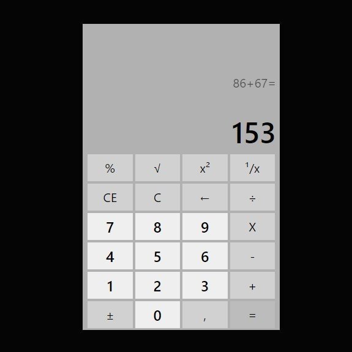

# Windows Calculator Clone Project

> This is a clone of windows calculator desktop app. 

---

### Table of Contents
- [Description](#description)
- [Project Images](#project-images)
- [References](#references)
- [License](#license)
- [Author Info](#author-info)

---

## Description

This project clones the calculator app from windows, in design and logic behind it. This project was made just to train Javascript abilities and pure programming logic, but the calculator is functional.

#### Technologies

- HTML5
- CSS3
- Javascript ES6

[Back To The Top](#windows-calculator-clone-project) 
[Back To Table of Contents](#table-of-contents)

---

## Project Images

[Back To The Top](#windows-calculator-clone-project) 
[Back To Table of Contents](#table-of-contents)

---

## References

- HTML template - [Hcode Treinamentos](https://github.com/hcodebr/curso-javascript-projeto-calculadora-win)

[Back To The Top](#windows-calculator-clone-project) 
[Back To Table of Contents](#table-of-contents)

---

## License

MIT License

Copyright (c) 2020 GabrielMCavalcante

Permission is hereby granted, free of charge, to any person obtaining a copy
of this software and associated documentation files (the "Software"), to deal
in the Software without restriction, including without limitation the rights
to use, copy, modify, merge, publish, distribute, sublicense, and/or sell
copies of the Software, and to permit persons to whom the Software is
furnished to do so, subject to the following conditions:

The above copyright notice and this permission notice shall be included in all
copies or substantial portions of the Software.

THE SOFTWARE IS PROVIDED "AS IS", WITHOUT WARRANTY OF ANY KIND, EXPRESS OR
IMPLIED, INCLUDING BUT NOT LIMITED TO THE WARRANTIES OF MERCHANTABILITY,
FITNESS FOR A PARTICULAR PURPOSE AND NONINFRINGEMENT. IN NO EVENT SHALL THE
AUTHORS OR COPYRIGHT HOLDERS BE LIABLE FOR ANY CLAIM, DAMAGES OR OTHER
LIABILITY, WHETHER IN AN ACTION OF CONTRACT, TORT OR OTHERWISE, ARISING FROM,
OUT OF OR IN CONNECTION WITH THE SOFTWARE OR THE USE OR OTHER DEALINGS IN THE
SOFTWARE.

[Back To The Top](#windows-calculator-clone-project) 
[Back To Table of Contents](#table-of-contents)

---

## Author Info

- Github - [GabrielMCavalcante](https://github.com/GabrielMCavalcante)

- LinkedIn - [Gabriel Cavalcante](https://www.linkedin.com/in/gabriel-cavalcante-4182061a2)

[Back To The Top](#windows-calculator-clone-project) 
[Back To Table of Contents](#table-of-contents)
